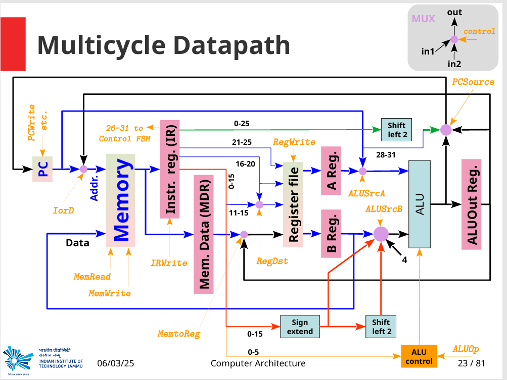
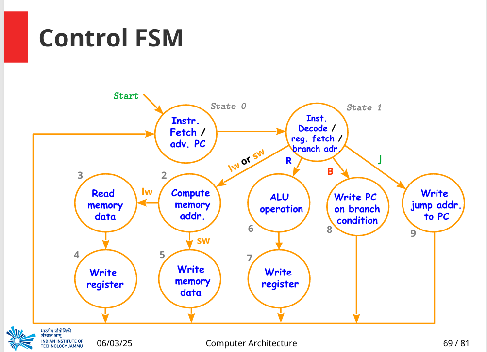

# MIPS Multicycle Processor – Easy Guide 👋

Welcome!  This project shows how a classic 32-bit **MIPS** CPU can be built with **just one ALU and one memory port** by doing the work in **14 small steps (states)** instead of one giant step.  
Everything is written in clean Verilog and comes with an automatic testbench.

---

## 📁 Folder Map (what’s where)

| Folder / file | What it is |
|---------------|------------|
| **src/**      | All Verilog modules that make the CPU work |
| **tb/**       | Testbench + `program.mem` (the code the CPU will run) |
| **docs/img/** | Two PNGs that draw the datapath and the control FSM |
| **MIPS_Multicycle.xpr** | *Optional* Vivado project if you like GUIs |
| **README.md** | This file |

---

## 🖼️ How the CPU Looks

### 1.  Datapath (wires & boxes)



*Blue* lines are data.  
*Orange* arrows are control signals.  
Because we re-use parts, the same ALU adds, subtracts, shifts, etc., one state at a time.

### 2.  Control FSM (the brain)



The CPU walks through **14 states (0 to 13)**.  
Each state turns on a small set of control lines so just the right thing happens.

---

## 🔦 Quick Demo (see it run!)

> Needs **Icarus Verilog** or **ModelSim** / **Vivado** – pick one.

```bash
# inside repo
iverilog -g2012 -o run.vvp src/*.v tb/multi_cycle_processor_tb.v
vvp run.vvp
